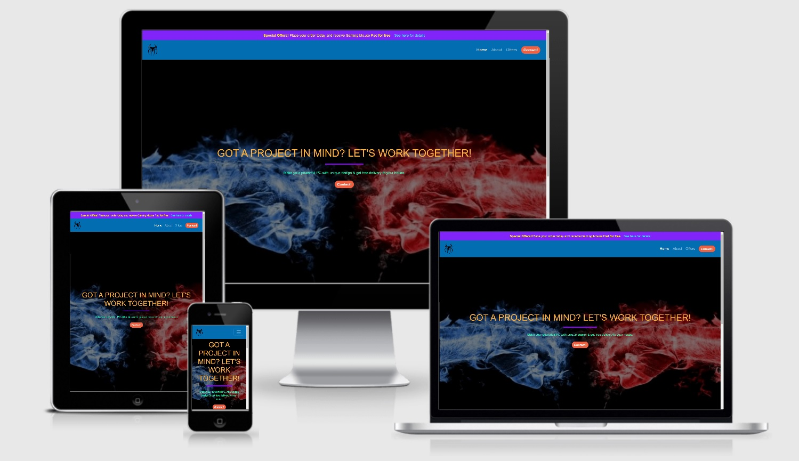
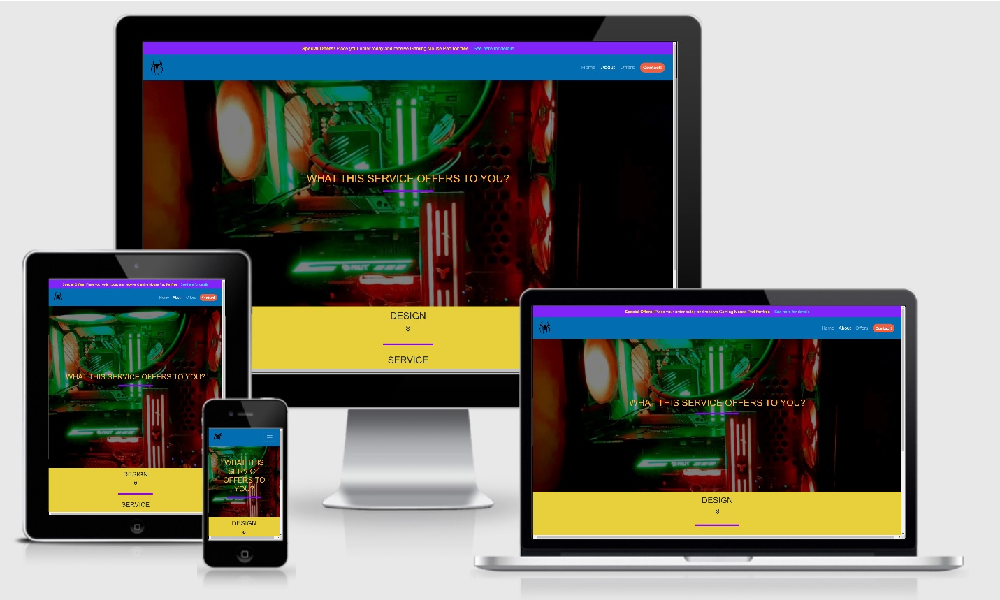
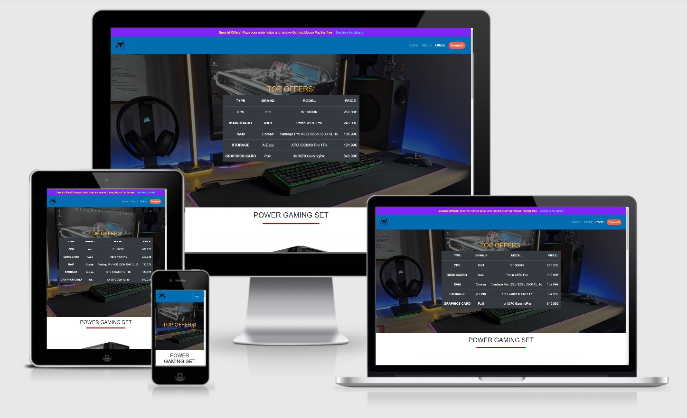
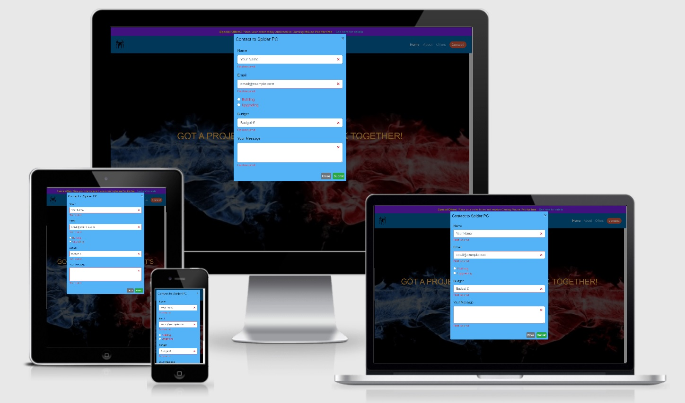
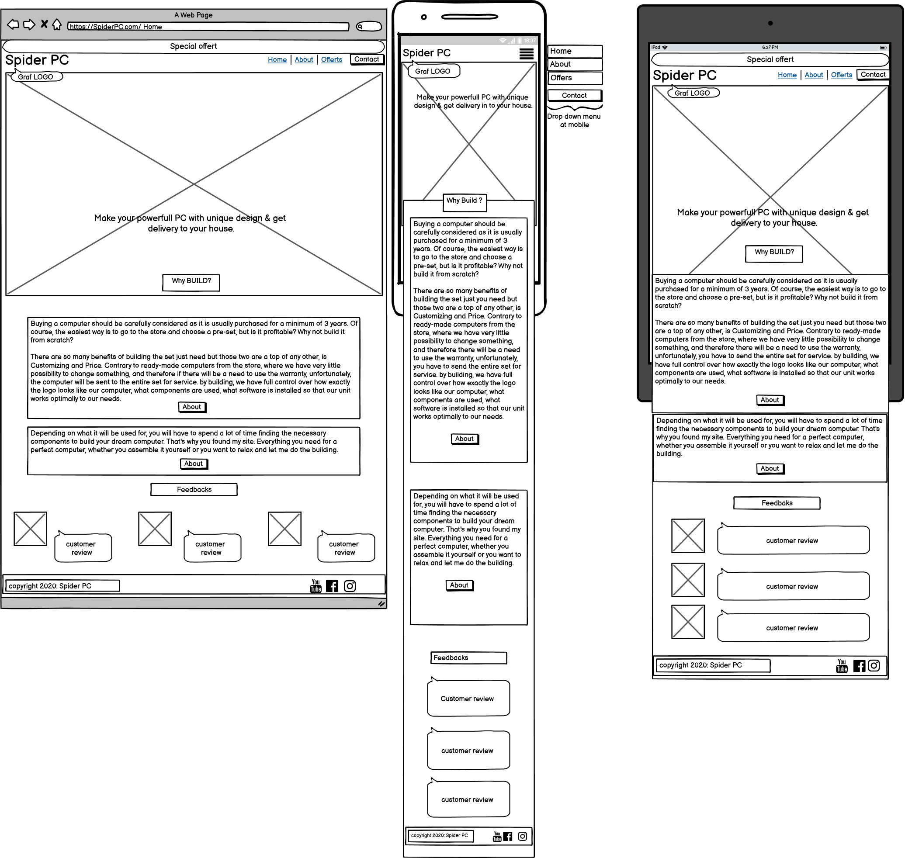
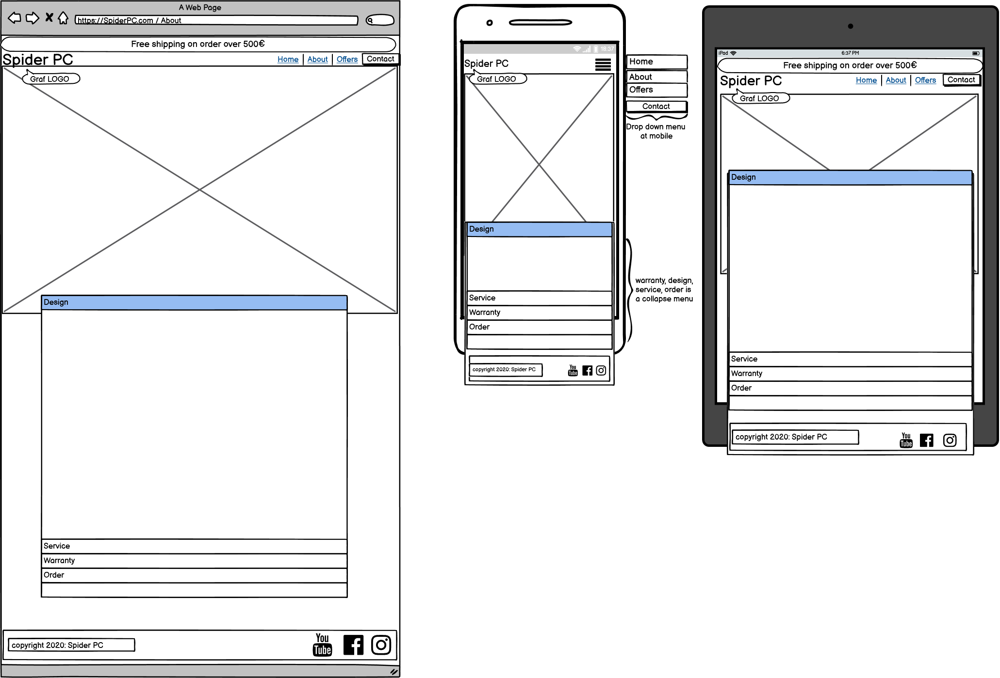
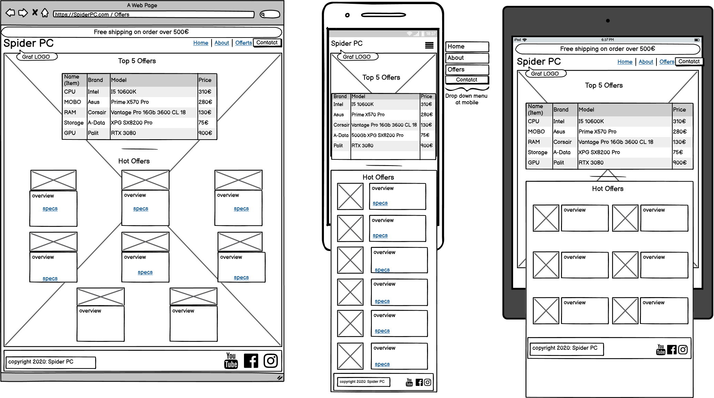
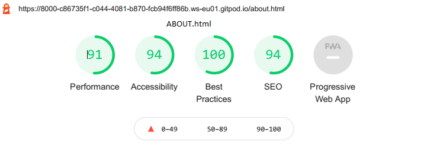
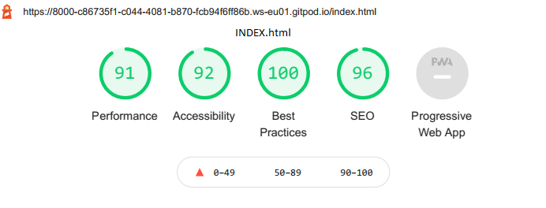
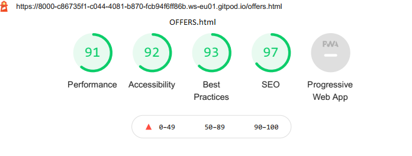

# Spider PC - Building Customizing And Upgrading Computers

Code Instytute - Milestone Project 1

This project is a three-page webside to bulding customizing and upgrading computers. The purpose of the website is to create personalized computers by enthusiasts who put emphasis on user projects to make their computers unique and fully personalized to their needs.

# Webside Showcase
+ Home

+ About

+ Offers

+ Contact from

# UX

## As a owner of the webpage:

+ I want to make users aware of the benefits they can achieve by building their own computer.
+ I want to build unique PCs.
+ I want to research various solutions / types of components to meet the customers needs.
+ I want to create a clear, concise and easy to navigate website.

## As a customer

+ I want to research the best price for components.
+ I want to get best warranty option for the product.
+ I want my computer to be built by profesionals who will understend all my needs.
+ I want an easy to navigate website.

## My project planning
My project planning can be download [here.](https://github.com/PiotrWojniak/MS1/blob/master/readme/wireframe/wireframeMS1-Piotr-Wojniak.pdf) and is display below.

+ Home

+ About

+ Offers

+ Contact

# Design

My site is geared towards computer technology offering users the best solutions on the market aware of the benefits of building a Pc from scratch, because the Pc is built from the start the users can save money instead of overpaying for a ready built pc. I aim to help my users / customers who may not have the knowledge or time to build or upgrade their Pc. The objective here is customer satisfaction. I want to provide a top service aimed at hopefully reducing the costs for the customer but most importantly I want to bring their Pc to life through large amounts of personalisation to meet the tastes and needs of the customer. I research various components and solutions to help my users chose the best options for them. 

## Colours
This webpage is create with those colours:
+ Blue - Features attributed to blue are First of all, trust, reliability, and stability. This color is closely related to technology, for example, Intel Hewlett-Packard, Dell, IBM. In terms of technology, trust and security are key and these are the features we are looking for. Thats why I use them for my navbar and footer.
+ Yellow - I use this as a main colour because it is credited primarily with optimism and warmth, thanks to which we can build some moments of reflection at the customer - all this to evoke a desire to buy a product or use a specific service.
+ Red - I used red because it is the color that calls for action. That's why it was used in buttons and promotion, and to illuminate buttons in the navbar
+ Violet - Works very well when we want to convey to recipients that our website is about serious issues that why is used as a top bar in navbar with actual promotion
+ White - Means simplicity, purity, the truth emphasizes the conceptual message of the products, and at the same time refinement and elegance, which is why it was used as the basic color in the offer to emphasize the content.

## Font familly 
+ Roboto:ital - to style inside button text and navigation bar menu, hedings H1;
+ Handlee - to style feedbacks.
+ Roboto+Mono:ital - to style feedback footer.
+ Lato:ital - to style all of the other content of the webpage.

## Backgroung image
+ On the home page, it shows two fists in blue and red. These colors correspond to the two computer parts companies Intel and Amd that compete with each other for each customer.
+ About image presents one of the computers I have built, showing a beautiful interior. Stimulates the imagination by creating visions of how it can be personalized to make it unique and special.
+ Offers page has no image the shape of the page is completely white to highlight the parts of the kit ready for sale.

# Features

## Existing Features

1. Contact form  
+ user can fill contact form whith details of Name, user email, 
+ choose service like upgrade or build, 
+ the amount of money you want to spend, 
+ message related to the choice of what he wants to change with the upgrade wobbler or when choosing a build preference and using the computer

2. Footer whith social media icon to follow my side
3. Navigation bar there are links to the “Home”, “About” and “Offers” page. There is also contact which will bring up the contact form.
4. Buttons on Offers webside to redirects to the manufacturer's for full specification.
5. Acordion whith 4 headings: “Design", “Service”, “Warranty” and “Orders” each one has pointer down.

## Features Left to Implement
+ Add basked for user to make shopping faster
+ Payment option as PayPal
+ Add section in offers to allow user make life changes of components in offered PC
+ Change contact button to register and sign in/sign up

# Technology

## In this project I use the following technologies.

1. [HTML](https://en.wikipedia.org/wiki/HTML) - to creating structure and layout of the webpsite
1. [CSS](https://en.wikipedia.org/wiki/CSS) - to styling the website.
1. [Bootstrap](https://getbootstrap.com/) - for design and customize responsive mobile-first sites.
1. [Fontawesome](https://fontawesome.com/start) - for icon style.
1. [Google font](https://fonts.google.com/) - for font style.
1. [Balsamiq](https://balsamiq.com/wireframes/) - to create wireframes.
1. [GIMP](https://www.gimp.org/) - for rendering backgroung images

# Testing

## [W3C Markup Validation Service](https://validator.w3.org/)  
+ to validate html and css

### Error

1. Index.HTMLhtml
+ Img element missing alt atribute in feedback section.
+ Attribute novalidate not allowed on element div in modal class.
+ Image in to big resolution
+ Attribute wfd-id not allowed on element button.(line 51, column 25; to line 51, column 132)
+ Attribute href not allowed on element button. 
+ Element style not allowed as child of element body 

1. About.html
+ Attribute wfd-id not allowed on element button.(line 51, column 25; to line 51, column 132)

1. Offers.html
+ width and heigh insert inline whith img for free item.

### Error Fix

1. Index.html
+ Add alt artibut in to the feedback img.
+ Remove novalidate atribute from div at modal class.
+ Replaced img whith lower resolution to improve loading the webpage.
+ Remove wfd-id artibut from button element.
+ Change button to a class to remove error whith href.

1. About.html
+ Remove wfd-id artibut from button element

1. Offers.html
+ Remove inline size from img and ann in to style.css

### Error to be fixed in the future

1. Offers webpage - Missing contact form on mobile.

## [Lighthouse 6.4.0] 

### To testing 
1. Performance - to check how fast web page is loaded
2. Accessibillity - for contrast, navigation, names and labels
3. Best practice - for user experiance
4. SEO - for mobile friendly

### Testing result

## Manuly Testing and functionality

### Computer
#### Desktop 
1. Firefox
2. Edge
3. Chrome

#### MacBook Pro
1. Safari

Home page
+	On top of the page there is a special offers bar. If you press on “see here for details”, it will bring you to the offers page. 
+	On the navigation bar there are links to the “Home”, “About” and “Offers” page. There is also contact which will bring up the contact form.
+	There are headers and a button which brings to the contact form. This section has an image of two fists in the background. 
+	As you scroll down the image disappears. Then there is text about the benefits of building a pc from scratch. There are also buttons which will bring you to the “About” or “Offers” page. 
+	Then there are customer feedbacks which are side by side. There is a picture of built or upgraded computer for each of the customers along with a short comment. 
+	On the footer there is the copyright of the website. Along with icons that once pressed bring you to the chosen social media page. 

About page
+	In the background there is an image of a computer with the header. 
+	As you scroll down the image disappears. There are then 4 headings: “Design", “Service”, “Warranty” and “Orders”. Each heading has paragraph of text which give a brief description. 

Offers page
+	In the background there is an image of a full computer set up. 
+	There is a header followed by a table of the top 5 offers. 
+	As you scroll down the image disappears. There are headers and an image of a computer. Below that there is text and an image of a mouse pad alongside it. 
+	There are 2 rows of cards. Each row has 4 different cards. 
+	Every card has a header of the product it is showing along with the image and a description of the product. 
+	Depending on the length of the description some cards have a bar which allows you to scroll up and down. 
+	Each product has button which will bring you to the producer’s page. 

Contact form
+	When you press on the contact button on the navigation bar it will bring up the contact form. 
+	There are required fields which have to be filled out for the contact form to be valid. 
+	There are 2 buttons “Cancel” and “Submit”. The Submit function will only work if required fields are filled in. 

### Mobile 

#### Samsung Galaxy A7
+ Firefox
+ Chrome

#### Iphone XS-max
+ Safari

Home page
+	The navigation bar has a drop down menu which has the links to the “Home”, “About” and “Offers” page.
+	The feedbacks are stack. There are no images of the built or upgraded computers.

About page
+	There are buttons which once pressed expand and show the text. 

Offers page
+	The image of the mousepad is underneath the text. 
+	There are 8 cards. These are stack one on top of the other. 

Contact form
+	There is no link to the contact form in the drop back menu on the navigation bar. 

# Bugs and Problems

1. Missing comments when commiting changes
+ Create css file - opaque-overlay, jumbotron, collout-container 
+ Fix img display for wireframe in README.md

2. The button responsible for collaps the text remains active even if it should be turned off in acordion container - about.html.
+ Fix - remove blocking collapse attribute for devices above small and add pointer to each collaps section.

3. Offers table override navigation bar on the extra small screen - offers.html
+ Fix - turn off visibility on the small screen and below.

4. Column not display properly on screen above 1024pix.
+ Fix - add column display ruls for screen above large.

5. Scrolling bar displayed in offers card.
+ Fix - blocking display in all web browser platform.

# Deployment

## To create a repository:
1. Go to the GitHub web page and login
1. Click Repository on the right side of the profile
1. Click New green buton on rigt side
1. Choose your repository name and click create repository button on bottom

## To deploy a website on GitHub Pages, follow these steps:
1. Go to the repository page
1. Click on settings icon in the top of the page
1. Find "GitHub Pages" section
1. Click on the "Source" dropdown menu
1. Select "master branch" option
1. A green success message should appear in the "GitHub Pages" section with the link to the live preview of the project.

# Credits

1. [Benchmark.pl](https://www.benchmark.pl/) - Thanks to the Editors of Benchmark.pl for consent to the use of photos from articles in accordance with the copyright by providing the source. 